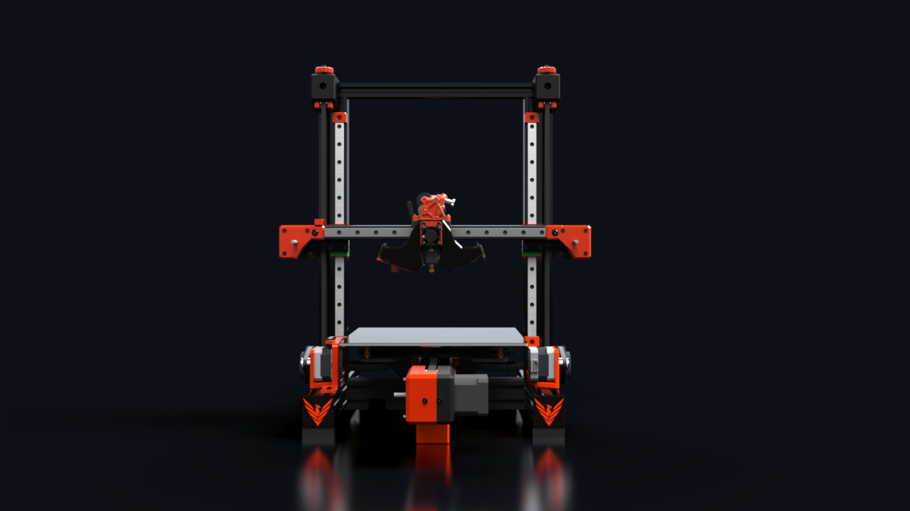
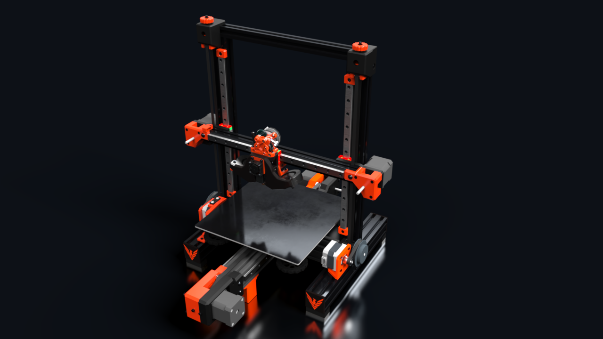
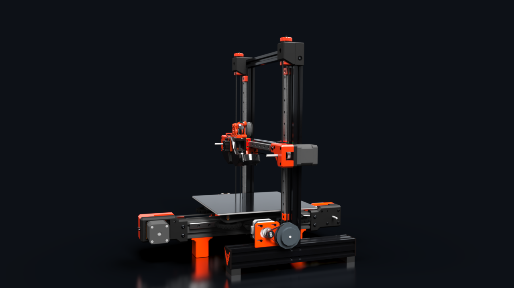
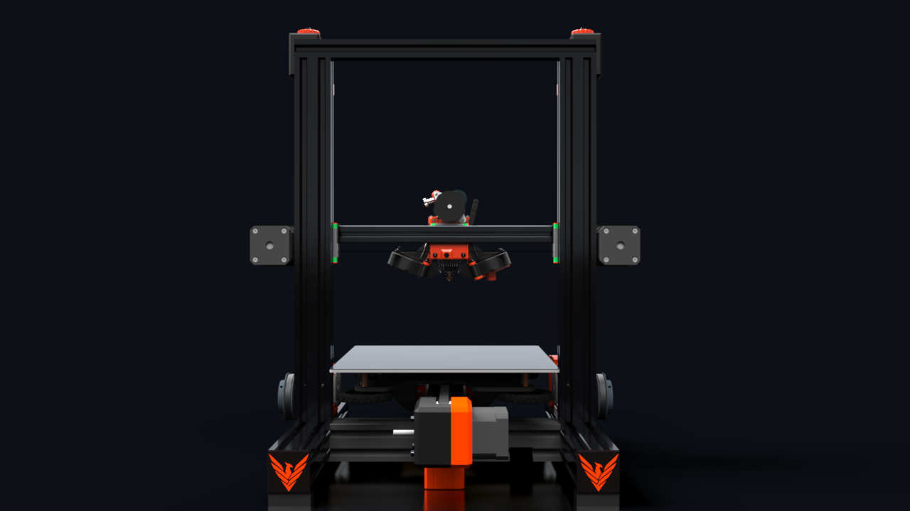
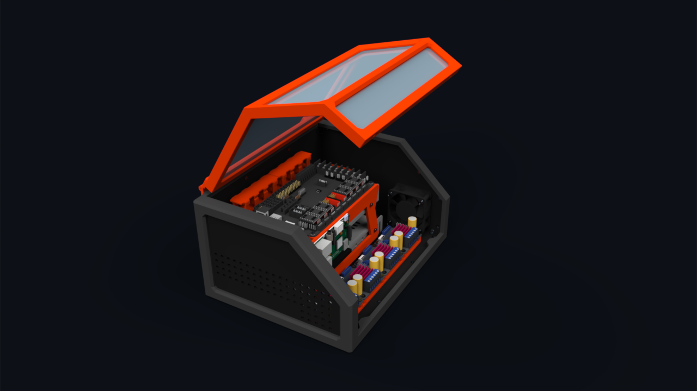
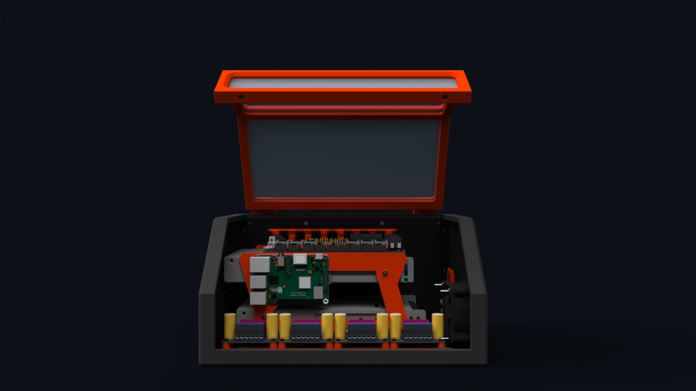
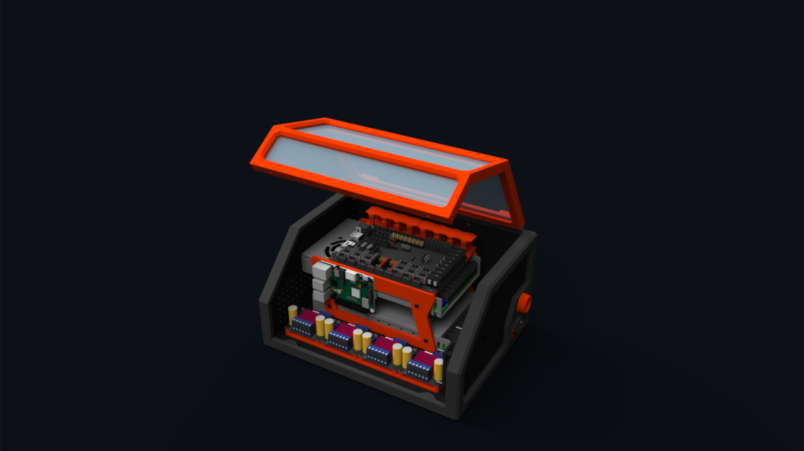
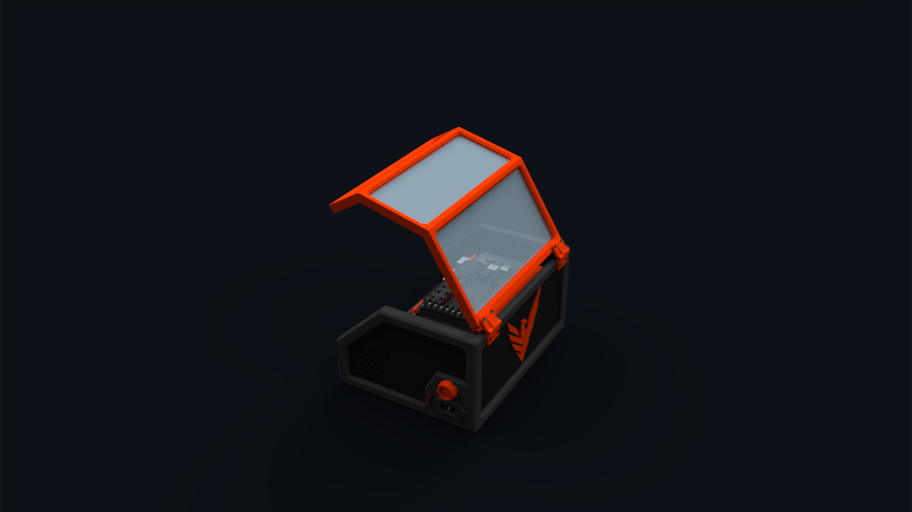
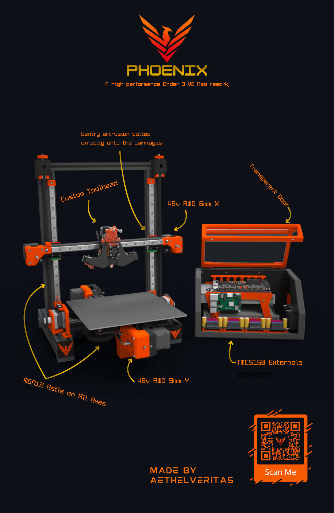

  
  <h1>Phoenix</h1>

    
Like the mythical phoenix, this printer is reborn from ashes....or rather dust in this case. Phoenix is a high performance makeover of an old Ender 3 V2 Neo, with the end goal decent prints at high speeds, such as 600 mm/s. For a live interactive visualization of the CAD, see the [public Onshape document](https://cad.onshape.com/documents/befe8a04a77aa90d2475bc93/w/b39d9063025263563386822a/e/ff3fb2fc7d22184183b603e8?configuration=default&renderMode=0&uiState=6a1c8ebda77b945ac73cbd7b)

## Features
- **Rigid gantry.** The Phoenix uses a 2020 extrusion bolted into the vertical MGN12H rail carriages and front Z rails instead of the more popular inside Z rail mounting, ensuring better rigidity.
- **Original belted Z attachement style.** Unlike many other belted Z bedslingers, which often have the tensioner on the gantry, this printer uses a separate top mounted Z tensioner, as well as belts attached directly to the motor mount (using a belt and pin system similar to certain CoreXY toolhead carriages) and right behind the 2020 extrusion, which should help with rigidity and tension on the printed gantry parts.
- **AWD 6mm X, with double shear and a MGN12H rail**
- **AWD 9mm Y, with double shear liveshaft idlers, and MGN12H rails**
- **6mm belted Z, with two 4:1 drivetrains.**
- **Reuses a Ender 3 V2 Neo frame**
- **48V for both X and Y**
- **Custom toolhead.** The [Aeolus](https://github.com/AethelVeritas/Aeolus) toolhead has been designed specifically for this printer. The X motor double shear covers have cutouts in order to maximize X travel when using said toolhead. 
- **Custom ebox**, featuring transparent door panels and external TMC5160 drivers. 

<h3>Gallery</h3>

## BOM
The BOM can be found [here](https://docs.google.com/spreadsheets/d/19SDQH5rKj-VOt543ikEq3R2ylwxd--UoErljUox35hg/edit?gid=0#gid=0) or as a BOM.csv. 

## Wiring
Wiring the motors, drivers, endstops, probe, hotend, etc in the Octopus Pro should be pretty simple, as it's mostly just a matter of plug and play. For the ebox wiring, please see [this](/Images/ebox_wiring.png)  

## Why did I make this? 
You may be asking yourself: why even waste money on an Ender/Cartesian bedslinger insted of making a CoreXY? Well CoreXYs are anything but cheap, and while I did initially want to build one (as can be seen in the JOURNAL.md), I quickly realized that it'd be too expensive, which is why I switched to Cartesian as the more affordable option. However, I've done my best to use as many parts that can later be used in a CoreXY build as possible, such as 9mm pulleys, live shaft idlers, F695 flanged bearings and of course, long shaft motors.

## Credits
- [Kevender](https://github.com/kanin2/KevEnder) for the Y carriage and inspiration for the Y motor mounts.
- [LH Stinger](https://github.com/lhndo/LH-Stinger/) for inspiration for the Z drivetrains.
- Ice Cream Factory Discord for all the useful advice they have provided. 
- Hackclub's [Fallout](fallout.hackclub.com) event for the funding. 

### Zine 

